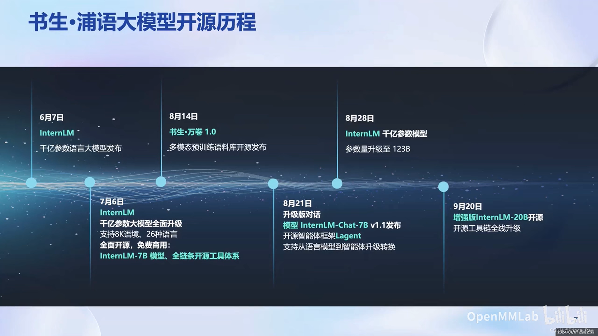
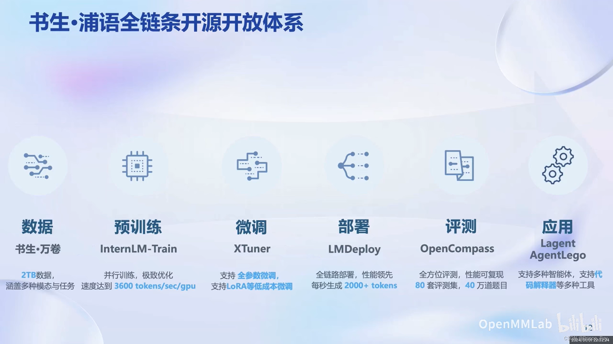
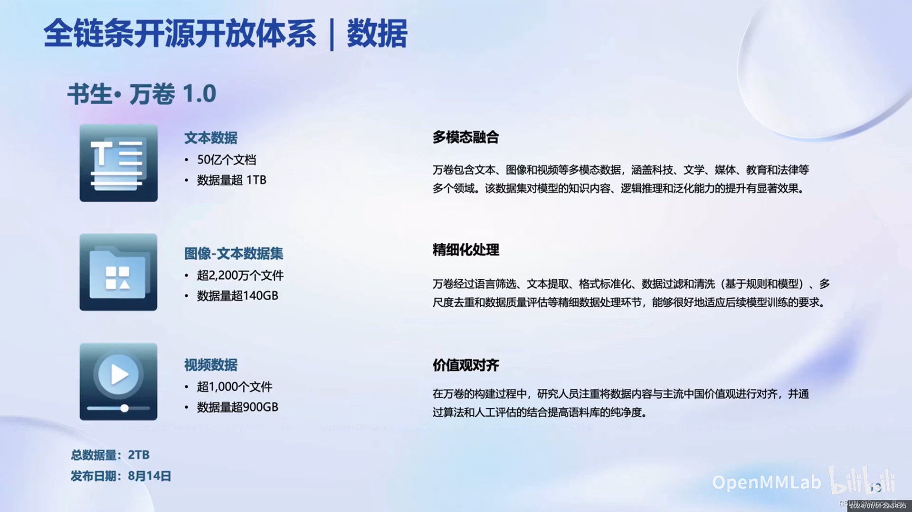
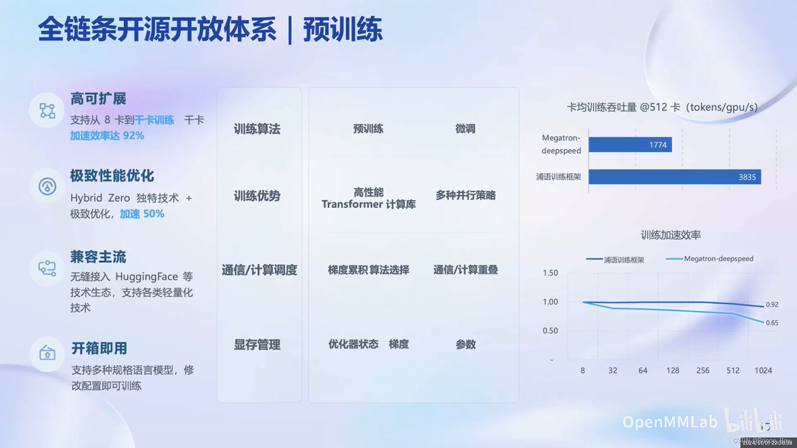
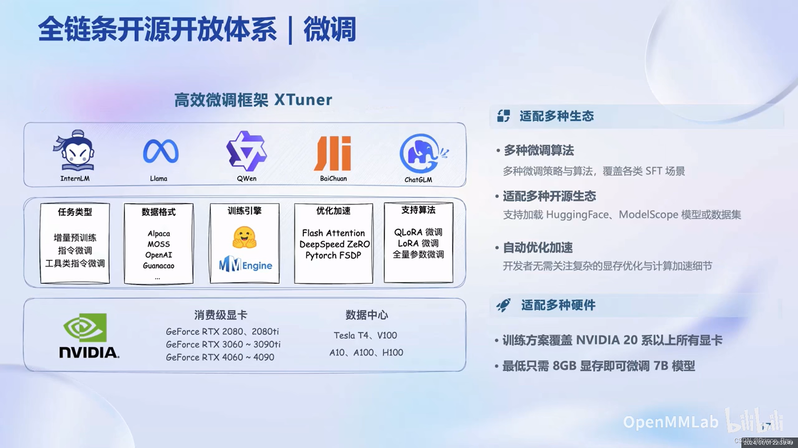
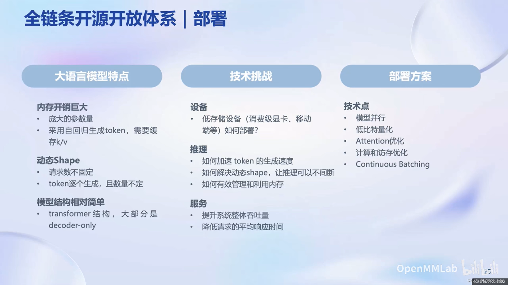
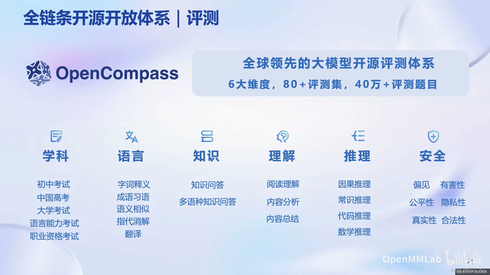
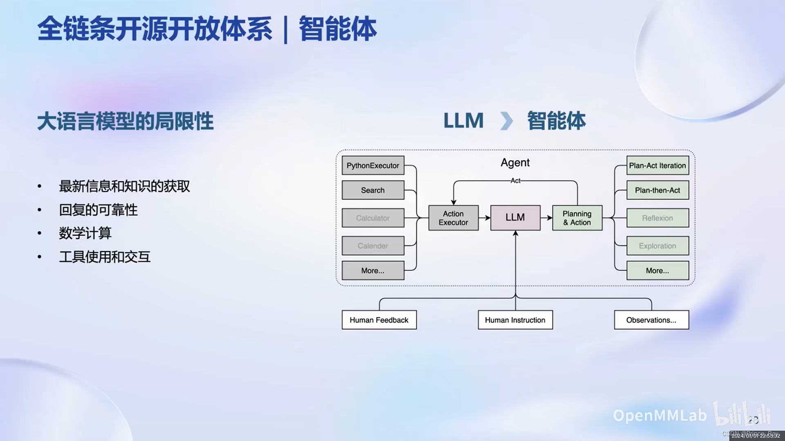
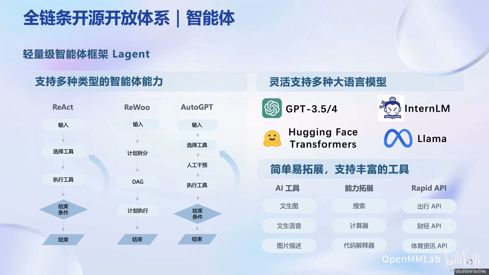

# 第一讲 书生·浦语大模型全链路开源体系
随着大模型的飞速发展，其逐步已成为人工智能发展的重要途径。模型的功能也由针对特定任务的专用模型转向针对多任务多模态的通用模型

InternLM自6月发布后，迄今为止已将开源工具链全部升级

目前的全链条开源开放体系分为数据、预训练、微调、部署、评测以及应用这六大主要模块。

## 数据

数据量2TB，包含文字、图片、视频等多种模态

## 预训练

高度可扩展，并对模型性能进行优化，加速训练

## 微调

适配多种生态、多种算法、多种硬件
## 部署

针对大模型有多种部署方案

## 评测

全面的评测体系
## 应用

对Agent的调用与设计

提出了轻量级智能体框架Lagent