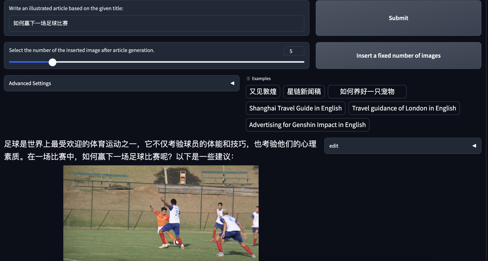
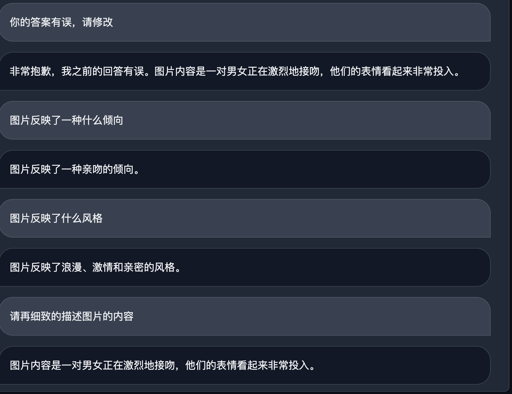

# 第二节课作业
## 基础作业1: 使用 InternLM-Chat-7B 模型生成 300 字的小故事
### 终端输出

### Web Demo输出关于Stable Diffusion小故事

### Web Demo输出关于足球小故事

## 基础作业2: 熟悉 hugging face 下载功能，使用 huggingface_hub python 包，下载 InternLM-20B 的 config.json 文件到本地
### 代码

### 下载文件内容

## 进阶作业1: 完成浦语·灵笔的图文理解及创作部署
### 图文创作: 如何赢下一场足球比赛

### 图片理解

## 进阶作业2: 完成 Lagent 工具调用 Demo 创作部署
### 求解方程

## 有趣的case
在图片理解的一个case中，XComposer对图片的理解有偏差，而且其不会听从指令纠正自己的错误，在对话过程中让其修改答案，模型却反复重复其最初的错误答案

